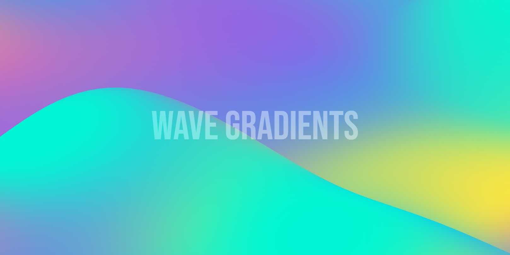

# 

I really liked the effect of the animated gradients on the
[stripe.com](https://stripe.com) home page and was curious of how it was
crated. Turns out it is more complex that it seems at first.

## It's not actually 2D at all

The first thing that came to mind when I saw the gradients was that they
were simply using a canvas surface for drawing and animating a bunch of
different gradients. Turns out it's actually a 3D scene rendered with
OpenGL that uses an [orthographic
camera](https://en.wikipedia.org/wiki/Orthographic_projection), a plane
mesh and
[two](packages/wave-gradients/src/stripe/vertex.glsl)
[kinds](packages/wave-gradients/src/stripe/fragment.glsl)
of [GLSL
shaders](https://developer.mozilla.org/en-US/docs/Games/Techniques/3D_on_the_web/GLSL_Shaders).

## What is this repo about?

As a first step, I am working on recreating the gradient effect in
[three.js](https://threejs.org), a popular 3D graphics library for the
web. Next, I will publish the effect as a library which can then be added
to npm. Finally, I will try to optimize the code to make it as
lightweight as possible (size-wise). This might involve dropping
three.js and reimplementing the effect in a more lightweight graphics
library. The reason I choose three.js as a starting point is because it
abstracts away a lot of the details of the underlying openGL code and
will make this project easier to implement for a beginner in 3D graphics
like me.

## Todo

- [x] Port code to three.js.
- [x] Get the thee.js gradient working.
- [x] Make the gradient to behave exaclty the same as the stripe gradient
- [ ] Recreate the neccessary vertex and fragment shaders
- [x] Add control to add/edit colors, config, etc. for the gradient
      instance.
- [x] Compare bundle size with the original stripe gradient. (~130kb 😔 minified)
- [ ] Use TWGL instead of three.js to reduce bundle size
- [ ] Either add an an example (or include as a tool in the demo) on how
      to generate a placeholder for the gradient while it loads using css. This
      is important since if the gradient is above the fold, it could negatively
      affect [FCP.](https://web.dev/fcp/)

## Credits

- [Stripe](https://stripe.com)
- [Kevin
  Hufnagl](https://kevinhufnagl.com/how-to-stripe-website-gradient-effect/)
  for the de-minified code
- Ashima Arts and Stefan Gustavson for the [Simplex noise functions](https://github.com/stegu/webgl-noise)
- Jamie Owen for the GLSL shader [color blending function](https://github.com/jamieowen/glsl-blend)
- [huemint](https://huemint.com) for the demo color palette generation
